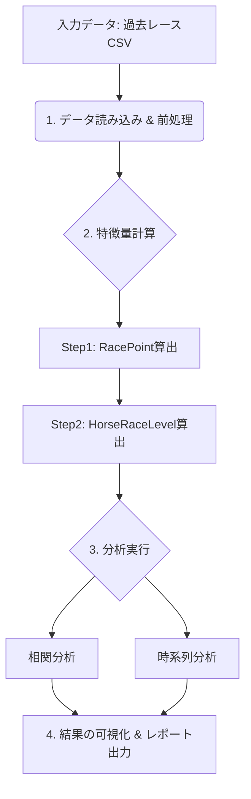

# 競馬データ分析における特徴量エンジニアリングと時系列分析：`HorseRaceLevel`指標の構築と検証

## はじめに：本稿の目的
本稿は、データ分析の実務未経験者が自身の課題解決能力・技術力・論理的考察力を実証するために作成した技術ポートフォリオである。

- **対象読者**: データ分析分野における実務経験者

## 第1部：ドメイン知識と分析課題の定式化

### 1.1 問題設定：競走馬の実績評価における「勝利の価値」の定量化

#### 1.1.1 従来手法の問題点

競走馬の能力評価において、勝利数や着順といった**実績**を単純集計する従来手法には**3つの分析上の問題**が存在する：

1. **比較可能性の欠如**: レースごとに競争強度（対戦相手の平均的実力）が異なるため、同一着順でも能力評価への寄与度は本来異なるべきである。例：「未勝利戦1着 vs G1の3着」
2. **情報損失**: グレード、賞金額、距離等の重要な説明変数を無視することで、予測精度や分析の信頼性が低下する。
3. **標準化の不備**: レース間の相対的価値が定量化されていないため、モデル内での比較が破綻し推論の妥当性が失われる。

#### 1.1.2 分析目標

本分析の主目的は、各競走馬がキャリアを通じて経験してきた**競走環境の厳しさを客観的かつ定量的に評価する合成特徴量**を構築し、その有効性を検証することである。

### 1.2. 解決アプローチ：合成特徴量 `HorseRaceLevel` の設計
この課題を解決するため、本データ分析では以下の2段階のプロセスを通じて各馬の実績を評価する合成特徴量 `HorseRaceLevel` を設計・検証する。

1.  **Step 1: 個別レースの「質」の定量化 (`RacePoint`)**
    
    個々のレースが持つ「質」を以下の3要素から総合評価し、単一の数値（`RacePoint`）に変換する。
    
         #### **RacePoint算出要素の概要**
     各要素の重み付けは、個別に複勝率との相関分析を実施し、相関の強さに基づいて決定：
     - **レースの格式**：G1からオープン特別までの6階層重み付け
     - **賞金額**：レース重要度を反映する客観的指標
     - **距離**：競争レベルに応じた距離別価値補正
     
     #### **重み決定プロセス**
     
     **Step 1: 個別相関分析**
     ```
     格式レベル vs 複勝率 → 相関係数 r₁
     賞金レベル vs 複勝率 → 相関係数 r₂ 
     距離レベル vs 複勝率 → 相関係数 r₃
     ```
     
     **Step 2: 相関強度に基づく重み算出**
     ```
　　 TODO
     ```
     
     **Step 3: 検証と調整**
     - クロスバリデーションによる重み妥当性確認
     - ドメイン知識による上下限制約適用
    
    #### **A. レースの格式 **
    数値的重み付けによる6階層評価システム：
    
    | 格式 | 重み | ベースレベル | 位置づけ |
    |------|------|-------------|----------|
         | **G1** | 10.0 | 9 | 最高格式 |
     | **G2** | 8.0 | 8 | 準最高格式 |
     | **G3** | 7.0 | 7 | 高格式 |
     | **重賞** | 6.0 | 6 | 中格式 |
     | **L・リステッド** | 5.5 | 5.5 | 準中格式 |
     | **特別戦** | 5.0 | 5 | 基本格式 |
     
     **ベースレベルとは**：そのグレードのレースに出走すること自体の基本価値。成績に関わらず、そのレベルのレースに参戦できることの評価ポイント。
     
     **重み（ボーナス）**：成績に応じた追加評価。勝利時は「ベースレベル + 重み」、複勝時は「ベースレベル + 重み×0.5」、4着以下は「ベースレベルのみ」で算出。
     
     **階層性の担保**：G1とG2の重み差（25%差）、G2とG3の重み差（14%差）により数値的に設計
    
    #### **B. レース場所**
    レースの重要度を反映する客観的な代理変数として1着賞金を使用。重みは複勝率との相関強度により決定。
    
    #### **C. レース距離**
    競争レベルに応じた距離別価値補正を3段階で適用：
    
    **1. 基本距離重み**
    
    | 距離帯 | 範囲 | 重み係数 | 特徴 |
    |--------|------|----------|------|
    | **中長距離** | 2001-2400m | **1.45** | 最高価値帯 |
    | **中距離** | 1801-2000m | **1.35** | 高価値帯 |
    | **長距離** | 2401m以上 | **1.25** | 特殊価値帯 |
    | **マイル** | 1401-1800m | **1.00** | 基準値 |
    | **スプリント** | 0-1400m | **0.85** | 減価帯 |
    
    **2. 2000m前後特別ボーナス**
    - **適用範囲**: 1900-2100m
    - **追加係数**: 1.35倍
    - **目的**: クラシック距離の特別評価
    
    **3. グレード×距離の相互作用ボーナス**
    - **適用条件**: G1/G2/G3 かつ 1800-2400m
    - **追加係数**: 1.15倍
    - **目的**: 高格式レースの中長距離での価値増幅

2.  **Step 2: 馬ごとの実績集約 (`HorseRaceLevel`)**
    次に、各馬の全出走履歴から`RacePoint`を集計し各馬に対して以下の2種類の指標を算出する。
    - **`AvgRaceLevel` (平均レースレベル)**: 出走レースの`RacePoint`の期待値。競走馬のキャリアにおける平均的なパフォーマンスレベルを示す。
    - **`MaxRaceLevel` (最高レースレベル)**: 出走レースの`RacePoint`の最大値。競走馬のキャリアにおけるピークパフォーマンス、あるいは到達能力の高さを示す。

**本分析の検証目標**: 上記のように設計された`HorseRaceLevel`が、馬の競走能力（本分析では「複勝率」を代理変数とする）と統計的に有意な正の相関関係を持つか否かを検証することである。

## 第2部：分析パイプライン
本データ分析のプロセスは、以下のパイプラインとして設計・実装されている。これにより、データ入力からレポート出力まで一連の処理が自動化され、分析の再現性が担保される。


## 第3部: 使用データと前処理

本データ分析の再現性と透明性を担保するため、使用データとその前処理について記述する。

### 3.1. 使用データ
本データ分析では、JRDBが提供する過去の競馬データ（有料）を使用する。
JRDBのデータは、レース結果だけでなく、馬の能力指数（IDM）やトラックバイアスなど多角的な情報を含んでおり、本分析の目的を達成する上で有用である。

- **データソース**: JRDB 成績データ（SED,SRB,BAC）
- **対象期間**: 2018年1月1日〜2023年12月31日
- **データ概要**:
    - **レース情報**: 開催日、競馬場、レース番号、距離、馬場状態、天候など
    - **競走馬情報**: 馬名、血統登録番号、騎手、斤量、馬体重など
    - **成績情報**: 着順、走破タイム、通過順、単勝オッズ、人気など
    - **JRDB独自指標**: IDM（能力指数）、ペース指数、上がり指数など

### 3.2. データの前処理
取得した生データは、後続の分析工程で利用可能な形式にするため、以下の前処理を適用した。これらの処理は、`process_race_data.py`によって実行され、分析の土台となるデータセットを生成する。

1.  **データクリーニングと型変換**:
    - **戦略的欠損値処理**:
        - **重要列の除外**: 分析の根幹をなす`着順`, `タイム`, `距離`, `馬名`, `IDM`に欠損値を含むレコードは、分析の妥do性を著しく損なうため、対象から除外した。
        - **一般列の補完**: その他の列については、統計的代表性を損なわない範囲で、数値データは`中央値`、カテゴリデータは`最頻値`で補完する戦略を基本とした。
    - **データ型変換**: 各列を分析に適したデータ型（例: `タイム`→浮動小数点数, `距離`→整数）へ変換した。

2.  **特徴量エンジニアリングと数値化**:
    `RacePoint`の計算に必要な特徴量を、以下の通り生成・数値化した。
    - **`グレード`の推定と数値化**:
        - **課題**: `グレード`列には一部欠損が存在するが、これはレースの「質」を測る上で極めて重要な特徴量であるため、単純な補完ではなく、他の特徴量からその値を推定するアプローチを採用した。
        - **推定ロジック**: `process_race_data.py`内の`MissingValueHandler`において、以下のドメイン知識に基づく階層的ロジックで`グレード`を推定した。
            1.  **賞金からの推定**: `本賞金`の額に応じて、G1, G2等の基準を適用。
            2.  **レース名からの推定**: `レース名`に「ダービー」「天皇賞」等の特定キーワードが含まれる場合、対応するグレードを割り当て。
            3.  **出走頭数・距離による補正**: `頭数`や`距離`が特定の閾値を超える場合（例: 16頭立て以上、3000m以上の長距離戦）、グレードを補正。
        - **最終処理**: このように推定・補完された後、`G1=1`, `G2=2`のように順序尺度として数値化し、モデルの入力特徴量とした。また、検証容易性のために、数値に対応する`Ｇ１`などの文字列を格納した`グレード名`列も別途追加した。
    - **`賞金`**: レースの重要度を示す客観的指標として「本賞金」を数値データのまま利用した。

3.  **分析用データセットの生成**:
    上記の前処理を経たデータは、`export/with_bias/`ディレクトリにCSVファイルとして保存される。このETLパイプラインは、データ生成と分析の責務を分離しており、分析プロセスの効率性、再現性、および保守性を高める設計となっている。

## 第4部：分析設計と技術的アプローチ（`analyze_race_level.py` 設計図）
### 4.1. 分析パイプラインの全体像
（再掲）本データ分析のプロセスは、以下のパイプラインとして設計・実装されている。


### 4.2. 特徴量エンジニアリング：`HorseRaceLevel` の算出ロジック
本分析の対象である`HorseRaceLevel`は、以下の2ステップで算出される。そのロジックの背景にあるドメイン知識と統計的判断を以下に詳述する。

#### **Step 1: 個別レースの「質」の定量化 (`RacePoint`)**
各レースに与えられる`RacePoint`は、以下の要素を線形結合して算出される。

`RacePoint = (基礎点) * (補正係数)`

**1. 基礎点：レースの基本的な「格」**
`基礎点 = (グレードレベル * w₁) + (賞金レベル * w₂) + (距離レベル * w₃)`

ここで、w₁, w₂, w₃は各要素と複勝率の相関強度に基づいて決定される重み

-   **`グレードレベル`**:
    -   **定義**: G1から未勝利戦までの公式格付けを、`G1=9`から始まる等間隔の順序尺度に変換したものである。
    -   **採用理由**: レースの公式な権威性を直接的にモデルへ導入するため、基本要素として採用した。

-   **`賞金レベル`**:
    -   **定義**: 1着賞金額の対数値をMin-Maxスケーリングによって[0, 1]の範囲に正規化した指標である。
    -   **統計的妥当性**: 賞金額の分布は裾が重く、少数の高額賞金レースに大きく歪んでいる。このため、対数変換を適用することで分布を対称に近づけ、外れ値の影響を抑制し、変数の安定性を確保する。
    -   **採用理由**: 賞金は、主催者によるレースの重要度付けを反映する客観的指標であり、グレードだけでは捉えきれない価値の差異を補完する目的で採用した。

-   **`距離レベル`**:
    -   **定義**: レース距離を5つのカテゴリー（スプリント/マイル/中距離/中長距離/長距離）に分類し、競争レベルに応じた価値係数を適用した指標。
    -   **統計的妥当性**: 距離と競争レベルの関係は非線形であり、2000m前後で最高値を取る山型分布を示す。
    -   **採用理由**: 同一格式・同一賞金でも距離により競争価値が変動するため、この影響を数値化して基礎点に組み込む。

-   **重み決定プロセス**:
    -   **個別相関分析**: 各要素（格式、賞金、距離）を個別に複勝率と相関分析
    -   **相関強度ベース重み**: r²を用いた正規化により各要素の重みを決定
    -   **検証**: クロスバリデーションとドメイン知識による妥当性確認

**2. 補正係数：ドメイン知識に基づく価値の調整**

-   **`距離ボーナス`**:
    -   **定義**: 特定の距離カテゴリのレースに対し、補正係数を乗算する。
    -   **パラメータ決定**: 「クラシック路線」と呼ばれる2000m前後のレースは競争が激化するというドメイン知識をモデルに組み込むため、予備分析としてボーナス係数を変化させ、目的変数との相関が最大となる値を探索した。その結果、1900mから2100mの距離範囲に対し、1.35の補正係数を乗算することが最適であると判断した。

-   **`交互作用ボーナス`**:
    -   **定義**: 特定の「グレード」と「距離」の組み合わせに対し、交互作用を考慮したボーナス係数を適用する。
    
    | グレード     | 距離カテゴリ   | ボーナス係数 | 根拠                                                                 |
    | :----------- | :------------- | :----------- | :------------------------------------------------------------------- |
    | G1, G2, G3   | 1800m - 2400m  | 1.15倍       | クラシック路線や主要G1レースが集中する、最も競争が激しい区間であるため。 |

#### **Step 2: 馬ごとの実績集約 (`HorseRaceLevel`)**
上記の`RacePoint`を基に、各馬に対し2種類の`HorseRaceLevel`を算出する。

-   **`AvgRaceLevel` (平均レースレベル)**:
    -   **算出方法**: 当該馬が過去に出走した全レースの`RacePoint`の平均値。
    -   **分析上の意味**: キャリアを通じたパフォーマンスの一貫性や、平均的な活動ステージのレベルを示す。

-   **`MaxRaceLevel` (最高レースレベル)**:
    -   **算出方法**: 当該馬が過去に出走した全レースの`RacePoint`の最大値。
    -   **分析上の意味**: キャリアにおける最大到達能力（ポテンシャル）やピークパフォーマンスを示す。

### 4.3. 検証する作業仮説
設計した合成特徴量 `HorseRaceLevel` が競走馬の能力を定量化する指標として有効に機能するかを検証するため、以下の3つの作業仮説を設定する。

#### **仮説1: `HorseRaceLevel`は競走能力の予測に有効である。**
-   **帰無仮説 (H₀)**: `HorseRaceLevel`と複勝率の相関係数 ρ は0である (ρ = 0)。
-   **対立仮説 (H₁)**: `HorseRaceLevel`と複勝率の間には、統計的に有意な正の相関関係が存在する (ρ > 0)。
-   **本仮説検証の意義**:
    1.  競馬という領域において、過去の競走履歴から将来のパフォーマンスを予測することは、期待値計算の根幹をなす。
    2.  `HorseRaceLevel`が有効であれば、勝利数や着順といった単純な実績指標よりも高次元な能力評価が可能となる。
    3.  本特徴量は、競馬予測サービスにおける精度向上や、データプロダクトとしての商業的価値創出に寄与する可能性がある。
-   **検証方法**:
    -   **説明変数**: `AvgRaceLevel`, `MaxRaceLevel`
    -   **目的変数**: `place_rate` (複勝率)
        - **選定理由**: 馬の安定した能力を測るため、1着だけでなく3着以内に入る確率である「複勝率」を目的変数として採用した。勝率は発生頻度の低いイベントであり、スパース性の問題から、より多くのサンプルで安定して観測できる複勝率が代理変数として適切と判断した。
    -   **分析手法**: 散布図による可視化、ピアソン相関係数の算出、および統計的有意性検定（p < 0.05）。

#### **仮説2: 平均レベルと最高レベルでは、予測力に差がある。**
-   **帰無仮説 (H₀)**: `AvgRaceLevel`と`MaxRaceLevel`の複勝率に対する予測力は等しい。
-   **対立仮説 (H₁)**: いずれか一方の指標が、より強い予測力を持つ。
-   **本仮説検証の意義**:
    1.  実務応用上、予測性能と計算コストのバランスを考慮し、最も寄与度の高い指標を選択することが求められる。
    2.  両指標の予測寄与度を比較することで、「一貫性」と「最大能力」のどちらが将来の成績と強く関連するかを評価し、予測モデルの戦略を決定できる。
-   **検証方法**:
    -   **比較対象**: `AvgRaceLevel`と`MaxRaceLevel`それぞれの相関係数。
    -   **評価基準**: 相関の強さ、決定係数（R²）、解釈性。

#### **仮説3: この分析手法は、異なる時期のデータでも再現性がある。**
-   **帰無仮説 (H₀)**: 異なるデータ期間において、`HorseRaceLevel`の有効性は再現されない。
-   **対立仮説 (H₁)**: 複数のデータ期間で、一貫して`HorseRaceLevel`と複勝率の正の相関が観測される。
-   **本仮説検証の意義**:
    1.  構築した指標の有効性が特定の期間に限定されず、時系列的に安定していることを示すことは、その指標の普遍性と信頼性を担保する上で不可欠である。
    2.  時間的普遍性を欠く指標は外的要因の変化に脆弱であり、実務的な応用価値が低い。
    3.  指標の有効性が時系列で安定していることを確認できれば、これを組み込んだ持続可能な予測モデルの構築が可能となる。
-   **検証方法**:
    -   **分析対象**: 3年間隔でのサブピリオド分析。
    -   **評価基準**: 各期間で算出された相関係数の一貫性。
    -   **実務への応用**: 結果の安定性に基づき、本指標の実用化の可否を判断する。

## 第5部：分析結果と考察
### 5.1. 相関分析：`HorseRaceLevel`と競走能力の関連性
### 5.2. 時系列分析：`HorseRaceLevel`の有効性は時代と共に変化するか
### 5.3. 今後の展望

## 結論：本ポートフォリオで示した能力 