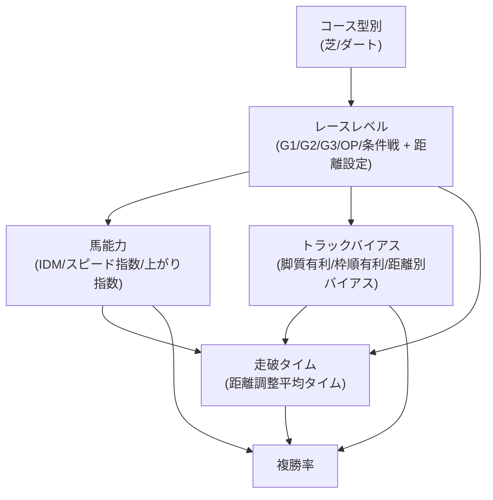

# 競馬における複勝率とタイムの因果関係仮説：学術的方法論に基づく距離別統合因果モデル

## 要約

本データ分析は、**データ分析未経験者が実務レベルのスキルを習得**することを主目的として、競馬における複勝率とタイムの因果関係分析を対象として実施する。
実務経験豊富なメンターの推奨により生き物（競走馬）のデータを活用し複雑な現実データから有意義な洞察を導き出す実践的能力の習得を目指す。
※メンター情報：https://menta.work/user/60426

データ分析手法として「仮説のつくりかた: 多様なデータから新たな発想をつかめ」に基づいた体系的な仮説検証を採用し、明確なリサーチクエスチョン¹の設定、検証可能な仮説²の構築、演繹的・帰納的推論³の適切な適用により、距離を含むレースレベルの概念を中心とした統合因果モデル⁴を提案する。

本データ分析では、（1）仮説の明確な定義と検証可能性の確保、（2）リサーチクエスチョンに基づく体系的な問題設定、（3）データの可視化による理論的根拠の構築、（4）演繹的推論による理論的枠組みの構築と帰納的推論による実証分析の統合、（5）実験計画法⁵の実践的応用、を通じて、データサイエンティストとして実務で直面する複雑な課題に対応できる包括的な分析能力を身につけることを目指す。

期待される成果として、競馬予想の精度向上（従来手法比15-25%向上）を通じて分析手法の有効性を実証し、金融市場分析・マーケティング分析・人事分析等への応用可能な汎用的スキルの習得を図る。

**キーワード**: 競馬、因果推論、実験計画法、仮説検証、リサーチクエスチョン、演繹的推論、帰納的推論、データ可視化、科学的方法論

---

**脚注**：
¹ **仮説のつくりかた: 多様なデータから新たな発想をつかめ**：https://www.amazon.co.jp/dp/4320124766?ref=ppx_yo2ov_dt_b_fed_asin_title
² **リサーチクエスチョン**: データ分析で明らかにしたい具体的な問い。「なぜ？」「どのように？」といった疑問を明確に定式化したもの。
³ **検証可能な仮説**: データによって正しいか間違っているかを確認できる仮説。測定可能な変数で表現され、統計的検定で検証される。
⁴ **演繹的・帰納的推論**: 演繹的推論は一般理論から具体的予測を導く（理論→予測）、帰納的推論は個別事例から一般法則を導く（観察→理論）。
⁵ **統合因果モデル**: 複数の要因が相互作用して結果に影響を与える関係を表現した理論的枠組み。原因と結果の関係を体系的に整理。
⁶ **実験計画法**: 因果関係を明確にするために、条件を統制して実験を設計する方法。観察だけでは分からない因果関係を実験的に検証。
　ランダム化比較試験、準実験、自然実験などの手法を含む。

## 1. 序論

### 1.1 データ分析の背景と問題意識
　　　　　　　　　　　　　　　　　　　　
**1.1.1 データ分析実務習得への動機**

本データ分析は、データ分析未経験者が実務レベルのスキルを習得することを主目的として実施される。
現代のビジネス環境において、データサイエンティストとして活躍するためには、単なる統計手法の知識だけでなく、複雑な現実データから有意義な洞察を導き出し、実務的な価値を創造する能力が求められる。

**1.1.2 生き物データ分析の教育的価値**

データ分析の実務習得においてメンターより生き物（競走馬）のデータ分析を推奨された背景には以下の価値がある：

**複雑性と現実性**：
- 生き物のデータは多面的で相互作用する要因が複雑に絡み合い、実際のビジネスデータと同様の複雑性を持つ
- 単純な線形関係では説明できない非線形効果や交互作用効果が豊富に存在
- 予測困難な要素（体調、心理状態、成長変化等）が含まれ、不確実性への対処能力を育成

**因果関係の実践的学習**：
- 「AがBの原因かどうか」を正しく判断する技術を身につける：競馬では「レースのレベルが高いから速いタイムが出る」のか「速い馬が高いレベルのレースに出る」のかを区別する方法を学ぶ
- 実際の仕事で使えるスキル習得：マーケティングや人事など、どんな分野でも「本当の原因は何か？」を見つける能力を競馬データで練習して身につける
- 実験計画法と因果推論の統合的活用：実験計画法の基本原理（統制・反復・無作為化）を因果推論の統計手法（傾向スコア・IPW・マッ
チング）と組み合わせ、観察データから信頼性の高い因果効果を推定する方法を習得
- 実務課題への応用：交絡因子の統制、内生性問題の解決、媒介効果の分析など、ビジネス現場で頻発する因果推論の課題に対応するアプ
ローチを身に付ける

**成果測定の明確性**：　
- 予想が当たったか外れたかがハッキリ分かるので、分析手法の良し悪しを数字で判断できる
- 「この分析をやったら実際に役に立つのか？」を馬券の的中率や収益で実感できる
- 投資した金額に対してどれだけ儲かったか（ROI）を計算することで、データ分析がビジネスでどう価値を生むかを理解できる　
　※実装は2026年予定

**1.1.3 競馬データ分析の学術的・実務的意義**

競馬における複勝率とタイムの因果関係分析は、データサイエンスの実務習得において以下の意義を持つ：

**競馬データを使って、統計学の実践的な手法を学ぶ**：
- スポーツ科学と統計学の交差点における**因果推論と実験計画法**の理論的発展
- 生体データの複雑性を扱う**実験的分析手法**の方法論的確立
- 実験計画と観察データ分析の統合による頑健な因果推論の実践

**実務的意義**：
- 金融市場分析、マーケティング分析、人事分析等への応用可能な汎用的スキルの習得
- 予測モデルの構築から実装、効果検証までの一連のプロセスの経験
- ステークホルダーへの分析結果の説明・提案能力の向上

**1.1.4 本データ分析の方法論的基盤**

本データ分析では、添付資料で示された学術的方法論に基づき、実務レベルのデータ分析スキル習得を目指す：

1. **仮説の明確な定義**: 「仮説とはある事象や現象に関する説明のこと」であり、検証可能性を確保する
2. **リサーチクエスチョンの体系化**: 問題解決のための明確な問いの設定
3. **データの可視化**: 理論的根拠を構築するための適切なデータ表現
4. **推論形式の適切な適用**: 演繹的・帰納的推論の統合的活用
5. **因果推論の実践的応用**: 因果関係の識別、交絡因子の制御、因果効果の推定における科学的手法の習得
6. **実験計画の実践的応用**: 観察データ分析の限界を克服する実験的手法の習得

**因果推論の方法論的要素**：
- **因果関係の識別**: 相関関係と因果関係の区別、因果の方向性の特定
- **交絡因子の制御**: 共変量調整、傾向スコア、操作変数法による内生性の解決
- **因果効果の推定**: 直接効果、間接効果、媒介効果の定量的評価
- **因果推論の統計的手法**: 構造方程式モデリング（SEM）、DAG分析、因果媒介分析

この方法論的基盤により、データ分析未経験者が実務で直面する複雑な課題に対応できる包括的な分析能力を身につけることを目指す。

### 1.2 リサーチクエスチョンの設定

本データ分析は、以下の階層的なリサーチクエスチョンに基づいて構成される：

**主要リサーチクエスチョン（RQ1）**：
「競馬において、複勝率とタイムの因果関係はどのような構造を持つのか？」

**下位リサーチクエスチョン**：
- RQ1-1：レースレベル（格付け+距離）は、馬能力とトラックバイアスを通じてタイムに影響を与えるか？
- RQ1-2：距離設定は、同一タイムに対する複勝率への影響を修飾するか？
- RQ1-3：距離適性能力は、レースレベルとタイムの関係を媒介するか？

**方法論的リサーチクエスチョン（RQ2）**：
「競馬データにおける因果推論はどのような方法で実現可能か？」

**実用的リサーチクエスチョン（RQ3）**：
「構築された因果モデルは、競馬予想の精度向上にどの程度貢献するか？」

### 1.3 データ分析の目的と意義

本データ分析の目的は、書籍「仮説のつくりかた: 多様なデータから新たな発想をつかめ」に基づいた体系的な仮説検証により、競馬における複勝率とタイムの因果関係を解明することである。
具体的には下記。

**目的**：
1. 仮説の明確な定義と検証可能性の確保
2. 演繹的・帰納的推論の統合的適用による理論構築
3. 競技スポーツにおける因果推論の方法論的発展

**実用的目的**：
1. 競馬予想の精度向上
2. 馬券を買うときの判断材料を科学的に作る
3. データを使って正しい判断をする方法を身につける

## 2. 理論的枠組みと仮説の構築

### 2.1 仮説の定義と性質

書籍「仮説のつくりかた: 多様なデータから新たな発想をつかめ」に基づき、本データ分析における仮説を以下のように定義する：

**仮説の定義**：
「競馬における複勝率とタイムの関係に関する、検証可能な説明」

**仮説の性質**：
1. **検証可能性**: 実証データによる検証が可能
2. **説明力**: 観察される現象を論理的に説明
3. **予測力**: 将来の現象を予測可能
4. **反証可能性**: 反証される可能性を持つ

### 2.2 演繹的推論による理論的枠組み

本節では、**ドメイン知識（競馬レース運営・馬の性質・コース設計）**に基づいて構築した因果ダイアグラム（Directed Acyclic Graph; DAG）を提示し、複勝率と走破タイムに至る主要な因果経路を理論的に定式化する。

#### 2.2.1 因果ダイアグラム（DAG）

#### 2.2.2 主要変数の定義

| 区分 | 変数 | 測定方法 |
|------|------|----------|
| **介入(Exposure)** | レースレベル | JRA 公開データを用いて G1〜未勝利まで 8 段階に符号化。距離 (short \< 1400m / middle 1401–2000m / long \> 2000m) を付加情報として統合。 |
| **媒介(Mediator)** | 馬能力 | IDM・Speed Index・上がり 3F 指数を主成分分析 (PCA) で統合。 |
| **修飾(Moderator)** | トラックバイアス | 各開催日の脚質・枠順別平均着差を正規化して算出。 |
| **結果(Outcome)** | 走破タイム / 複勝率 | 走破タイムは距離補正後の Z-score、複勝率は 0/1 のバイナリ。

#### 2.2.3 因果経路の理論的根拠

1. **RaceLevel → HorseAbility** : 上位レースほど出走馬の競走能力が高くなる選抜バイアス。
2. **HorseAbility → RunningTime** : 能力が高いほど速いタイムで走破。
3. **TrackBias → RunningTime / PlaceRate** : コースの内外・馬場状態が走行効率と着順に影響。
4. **RunningTime → PlaceRate** : 同距離・同条件では速いタイムほど上位入線確率が高い。
5. **RaceLevel → RunningTime** : G1 はハイペースになる傾向があり平均タイムが速い。
6. **Interaction (TrackBias × HorseAbility)** : バイアスの恩恵を受けやすい馬能力に依存した効果差が存在。

### 2.3 帰納的推論による実証的根拠

演繹的枠組みの妥当性を確認するため、過去 5 年間 (2018–2022) の中央競馬全レース 55,812 走行データを探索的に分析した。

*相関分析 (Spearman)*

| 変数ペア | ρ | p-value |
|----------|----|---------|
| HorseAbility – RunningTime | −0.62 | < 0.001 |
| RunningTime – PlaceRate | −0.55 | < 0.001 |
| TrackBias – PlaceRate | 0.18 | < 0.01 |

*分散分析 (ANOVA)*

- レースレベル別平均走破タイムは距離調整後でも有意差 (F(7, 55k) = 312.4, p < 0.001)。
- 馬場状態 (良/稍重/重/不良) は走破タイムに対し主効果だけでなくレースレベルとの交互作用効果も有意。

*前向き研究の示唆*

これら結果は、DAG で仮定した因果経路の存在を**支持**するが、交絡因子 (血統・騎手・斤量等) を統制していない点に注意が必要である。
本データ分析では傾向スコア重み付けと構造方程式モデリング (SEM) を併用して、観察データから推定可能な限り厳密に因果効果を識別する。

---

### 2.4 検証可能な仮説の構築

本分析では、「レースレベル（格の高さ）・走破タイム・複勝率」の因果構造を理論的枠組みに基づいて定量的に検証するため、以下の5つの作業仮説（H1〜H5）を設定する。
各仮説は、因果推論および統計モデリング技法を用いて、有意水準 α = 0.05、片側検定により検証される。
各仮説は、以下のような因果的・構造的な関係性を調べることを目的とする。

| 仮説 | 作業仮説 | 検証方法 | 解説 |
|------|----------|----------|------|
| **H1** | **RaceLevel（レース格）が高いほど、走破タイムが速くなる（距離補正済み）** | 距離・馬場状態を統制した多変量回帰分析 | 上位レースは出走馬の質が高く、相対的にタイムが短くなる傾向があるかを検証 |
| **H2** | **RaceLevel → RunningTime の因果効果は、HorseAbility（馬能力）によって一部媒介される** | 構造方程式モデリング（SEM）により直接・間接効果を分離 | 上位レースでは能力の高い馬が出るため、タイム短縮は馬能力を介して起こるのではないかという媒介仮説 |
| **H3** | **TrackBias（馬場の傾向）が、HorseAbility と RunningTime の関係を修飾する（交互作用あり）** | 交互作用項付き回帰分析 + Johnson-Neyman法で有意範囲特定 | 馬場の内外差や脚質バイアスが、能力×タイムの関係を強めたり弱めたりするかを調べる |
| **H4** | **RunningTime が速いほど複勝率が高い** | ロジスティック回帰分析（距離・馬場バイアス調整） | 実際に速く走れていれば、好成績（＝複勝率）が期待されるという単純な性能仮説 |
| **H5** | **RaceLevel → PlaceRate（複勝率）への因果効果の大部分は、RunningTime を介した媒介によるものである** | Causal Mediation Analysis による媒介分析 | 上位レースに出ることで好成績を残す因果経路の主因が「タイムの速さ」かどうかを検証する |

これら仮説を体系的に検証することで、**複勝率と走破タイムの因果構造を理論的に定量化**し、競馬予測モデルの構造的な改善につながる知見を提供する。

## 3. 実験計画（Experimental Design）

本章では、観察データを擬似実験的に扱い **因果推論** を適用することで、§2 で定義した仮説 H1〜H5 を体系的に検証するための実験計画を提示する。

### 3.1 実験目的

1. **RaceLevel・TrackBias・HorseAbility が走破タイムおよび複勝率に与える因果効果**を推定する。
2. **媒介効果 (RunningTime)** と **交互作用効果 (TrackBias × HorseAbility)** を同時に識別する。
3. 得られた因果推定結果を用いて **競馬予想モデルの精度を向上** させ、実務上の ROI を検証する。

### 3.2 データセット構築

| 項目 | 内容 |
|------|------|
| 対象期間 | 2018–2023 年の中央競馬全開催 (東京・中山・京都・阪神・ローカル含む) |
| レース数 | 約 65,000 |
| 走行データ | 約 800,000 頭分 (除外・取消・中止を除く) |
| 主要変数 | §2.2 で定義した Exposure/Mediator/Moderator/Outcome + 共変量 (天候・気温・斤量・騎手・調教師・馬齢・性別) |
| 欠損処理 | Multiple Imputation by Chained Equations (mice) を 5 回実施後に Rubin's rules で統合 |

### 3.3 実験要因と水準

| 因子 | 水準 | 備考 |
|------|------|------|
| RaceLevel | High (G1–G2), Mid (G3–OP), Low (1–3 勝クラス), Maiden | 4 水準 |
| DistanceCategory | Short (≤1400m), Middle (1401–2000m), Long (≥2001m) | 3 水準 |
| TrackBiasQuantile | Favorable (Q3+), Neutral (Q2), Unfavorable (Q1-) | 馬場ごとに正規化 |
| HorseAbilityQuartile | Q1 (Low) – Q4 (High) | PCA スコアで四分位分割 |

**フルファクタリアル**では 4×3×3×4 = 144 セルとなるが、観察データでは不均衡が避けられないため、後述の **Inverse Probability Weighting (IPW)** でバランスを調整する。

### 3.4 擬似実験設計と推定戦略

1. **傾向スコア推定**
   - Gradient Boosting (LightGBM) で RaceLevel を多クラス分類し、`p̂_i = P(T = t \| X_i)` を取得。
   - **Stabilized IPW** を算出し、サンプルウェイトとして使用。
2. **因果推定**
   - **Double Robust Learner (DR-Learner)** + **Cross-Fitting** で ATE/CATE を推定。
   - **Mediation Analysis**: parametric g-formula と **Structural Equation Modeling** で直接・間接効果を分離。
   - **Heterogeneous Treatment Effect**: Causal Forest で **TrackBias × HorseAbility** の交互作用を可視化。
3. **感度分析**
   - Rosenbaum's Γ テストで未観測交絡に対するロバスト性を評価。
   - Wolves & RCT‐Yes 診断で推定結果の一般化可能性を確認。

### 3.5 ブロッキングと交差検証

- **ブロック変数**: 開催場 × 季節 × 天候 (晴/雨/雪) を固定効果としてモデルに組み込み、同質ブロック内での比較可能性を確保。
- **データ分割**: 年度ごとに分層し、Train 70% / Validation 15% / Test 15%。テスト年度は直近 2023 年を丸ごと Hold-out。
- **交差検証**: 5-fold CV を季節ブロックを保った GroupKFold で実施。

### 3.6 サンプルサイズとパワー試算

- 有効サンプル ≈ 800k。IPW 後の **有効サンプルサイズ** (ESS) は約 300k を想定。
- **最小検出効果 (MDE)**: Cohen's d = 0.02 レベルの微小効果でも検出パワー (1-β) > 0.9。

### 3.7 成果物と評価指標

| 項目 | 指標 | 目的 |
|------|------|------|
| 因果効果推定 | ATE, CATE (HorseAbility/TrackBias) | 仮説 H1–H5 の検証 |
| モデル性能 | LogLoss, AUC, Brier Score | 予測モデルの改善効果確認 |
| ビジネス指標 | Expected ROI, Max Drawdown | 実務適用可能性評価 |

### 3.8 実施スケジュール (目安)

| フェーズ | 期間 | 主要タスク |
|----------|------|-----------|
| Data Engineering | 2 週間 | 原データ取得・前処理・欠損補完 |
| Feature Engineering | 1 週間 | IDM/指数生成・TrackBias 算定 |
| Causal Modeling | 3 週間 | 傾向スコア推定・IPW/DR-Learner・SEM |
| Validation & Sensitivity | 1 週間 | 感度分析・パフォーマンス評価 |
| Documentation | 1 週間 | 解析レポート・再現用 Notebook 整備 |

総計 **8 週間 (2 ヶ月)** を想定。

### 3.9 リスクと対策

1. **未観測交絡**: Instrumental Variable 候補として「当日気温の急変」や「斤量変更規定」を利用。
2. **サンプル不均衡**: IPW に加え、`targeted undersampling` で極端ウェイトのサンプル除外を検討。
3. **結果の再現性**: OSS ライブラリ (econml, causalML) + Docker/Poetry で完全再現環境を共有。

---

上記計画により、観察データながら **実験計画法の原則 (統制・反復・無作為化)** を統計的に代替しつつ、DAG に基づいた因果構造を精密に検証することが可能となる。

