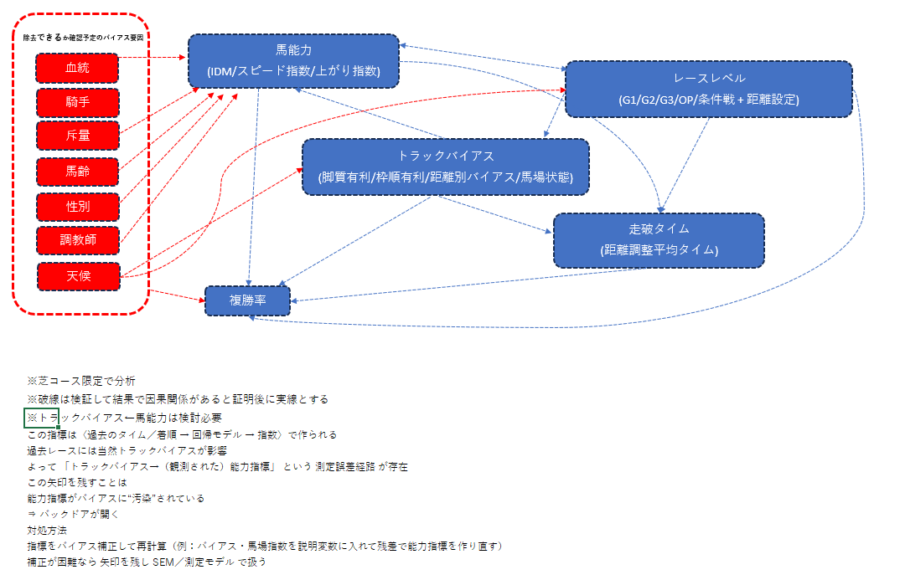

# 競馬における複勝率とタイムの因果関係仮説：学術的方法論に基づく距離別統合因果モデル

## 要約

本データ分析は、**データ分析未経験者が実務レベルのスキルを習得**することを主目的として、競馬における複勝率とタイムの因果関係分析を対象として実施する。
実務経験豊富なメンターの推奨により生き物（競走馬）のデータを活用し複雑な現実データから有意義な洞察を導き出す実践的能力の習得を目指す。
※メンター情報：https://menta.work/user/60426

データ分析手法として書籍「仮説のつくりかた: 多様なデータから新たな発想をつかめ」¹に基づいた体系的な仮説検証を採用し、明確なリサーチクエスチョン²の設定、検証可能な仮説³の構築、演繹的・帰納的推論⁴の適切な適用により、距離を含むレースレベルの概念を中心とした統合因果モデル⁵を提案する。

本データ分析では、（1）仮説の明確な定義と検証可能性の確保、（2）リサーチクエスチョンに基づく体系的な問題設定、（3）データの可視化による理論的根拠の構築、（4）演繹的推論による理論的枠組みの構築と帰納的推論による実証分析の統合、（5）実験計画法⁶の実践的応用、（6）因果推論手法の実践的応用を通じて、データサイエンティストとして実務で直面する複雑な課題に対応できる包括的な分析能力を身につけることを目指す。

期待される成果として、競馬予想の精度向上を通じて分析手法の有効性を実証し、金融市場分析・マーケティング分析・人事分析等への応用可能な汎用的スキルの習得を図る。
段階的学習により、データ分析初心者でも**実務レベルの包括的データ分析スキル**を着実に習得できる実践的カリキュラムを実施する。

**脚注**：
¹ **仮説のつくりかた: 多様なデータから新たな発想をつかめ**：https://www.amazon.co.jp/dp/4320124766?ref=ppx_yo2ov_dt_b_fed_asin_title
² **リサーチクエスチョン**: データ分析で明らかにしたい具体的な問い。「なぜ？」「どのように？」といった疑問を明確に定式化したもの。
³ **検証可能な仮説**: データによって正しいか間違っているかを確認できる仮説。測定可能な変数で表現され、統計的検定で検証される。
⁴ **演繹的・帰納的推論**: 演繹的推論は一般理論から具体的予測を導く（理論→予測）、帰納的推論は個別事例から一般法則を導く（観察→理論）。
⁵ **統合因果モデル**: 複数の要因が相互作用して結果に影響を与える関係を表現した理論的枠組み。原因と結果の関係を体系的に整理。
⁶ **実験計画法**: 因果関係を明確にするために、条件を統制して実験を設計する方法。観察だけでは分からない因果関係を実験的に検証。
　ランダム化比較試験、準実験、自然実験などの手法を含む。

## 1. 序論

### 1.1 データ分析の背景と問題意識
　　　　　　　　　　　　　　　　　　　　
**1.1.1 データ分析実務習得への動機**

本データ分析は、データ分析未経験者が実務レベルのスキルを習得することを主目的として実施される。
現代のビジネス環境において、データサイエンティストとして活躍するためには、単なる統計手法の知識だけでなく、複雑な現実データから有意義な洞察を導き出し、実務的な価値を創造する能力が求められる。

**1.1.2 生き物データ分析の教育的価値**

データ分析の実務習得においてメンターより生き物（競走馬）のデータ分析を推奨された背景には以下の価値がある：

**複雑性と現実性**：
- 生き物のデータは多面的で相互作用する要因が複雑に絡み合い、実際のビジネスデータと同様の複雑性を持つ
- 単純な線形関係では説明できない非線形効果や交互作用効果が豊富に存在
- 予測困難な要素（体調、心理状態、成長変化等）が含まれ、不確実性への対処能力を育成

**因果関係の実践的学習**：
- 「AがBの原因かどうか」を正しく判断する技術を身につける：例として競馬では「レースのレベルが高いから速いタイムが出る」のか「速い馬が高いレベルのレースに出る」のかを区別する方法を学ぶ
- 実際の仕事で使えるスキル習得：マーケティングや人事など、どんな分野でも「本当の原因は何か？」を見つける能力を競馬データで練習して身につける
- 競馬における「馬の素点」「レースレベル」「馬場状態」「騎手」などをDAG（有向非巡回グラフ）で表現し、交絡因子や媒介変数の整理を行うトレーニングを行います。
- 実験計画法と因果推論の統合的活用：実験計画法の基本原理（局所管理・反復・無作為化）をランダム化・層別・交互作用・直交表等で実施し、因果推論の統計手法（傾向スコア・IPW・マッチング等）と組み合わせ、観察データから信頼性の高い因果効果を推定する方法を習得
- 実務課題への応用：交絡因子の統制、内生性問題の解決、媒介効果の分析など、ビジネス現場で頻発する因果推論の課題に対応するアプ
ローチを身に付ける

**データ分析成果の明確性**：　
- 予想が当たったか外れたかがハッキリ分かるので、分析手法の良し悪しを数字で判断できる
- 「この分析をやったら実際に役に立つのか？」を馬券の的中率や収益で実感できる
- 投資した金額に対してどれだけ儲かったか（ROI）を計算することで、データ分析がビジネスでどう価値を生むかを理解できる　　※こちらの実施は2026年予定です。

**1.1.3 競馬データ分析の学術的・実務的意義**

競馬における複勝率とタイムの因果関係分析は、データサイエンスの実務習得において以下の意義を持つ：

**競馬データを使って、統計学の実践的な手法を学ぶ**：
- スポーツの研究と統計学を組み合わせ、「原因と結果を正しく見分けるための実験の考え方」を学ぶ
- 馬など生き物のデータが持つ複雑さを扱うために、実際に使える分析のやり方を身につける
- 実験データと過去の観察データをうまく組み合わせ、より確かな結論を導き出す方法を実践する
　※競馬では「馬に意図的な条件で行動させる実験」は困難です。その為、コース変更など自然に起きた“条件の切り替わり”を利用し、実験に近い比較を行う。

**実務的意義**：
- 金融市場分析、マーケティング分析、人事分析等への応用可能な汎用的スキルの習得
- 予測モデルの構築から実装、効果検証までの一連のプロセスの経験
- ステークホルダーへの分析結果の説明・提案能力の向上
- データ分析の実務習得において、メンターの推奨により生き物（競走馬）のデータを活用し複雑な現実データから有意義な洞察を導き出す実践的能力の習得を目指す。

**1.1.4 本データ分析の方法論的基盤**

本データ分析では、実務レベルのデータ分析スキル習得を目指す：

1. **仮説の作り方**: 「レースレベルが高いほどタイムが速くなる」等の仮説をデータで検証できる形にする
2. **問題の整理**: 「なぜ上位レースではタイムが速いのか？」等の問題を、小さな問いに分解する
3. **データの見える化**: 箱ひげ図や散布図等を使って、レースレベルとタイムの関係を視覚的に理解する
4. **論理的な考え方**: 「理論→予測→検証」の流れで、データから確かな結論を導く
5. **実験の設計**: 自然に起きた条件の変化を利用して、実験に近い比較を行う
6. **因果関係の分析**: 「本当の原因は何か？」を見分け、他の要因の影響を除いて分析する

**実験計画法の基本要素**：
- **局所管理**: 距離、馬場状態、レース格等の条件を揃えて比較する
- **反復による確認**: 複数のレース、複数の馬場で同じ分析を繰り返して確実性を高める
- **無作為化の工夫**: 本当の実験（くじ引きで馬をレースに振り分ける）ができないため、統計的に「くじ引きと同じ効果」を作り　　出す方法を使う
  - マッチング：同じ能力の馬同士を比較して、偶然の差を減らす
  - 重み付け：各馬の特徴を考慮して、公平な比較ができるよう調整する
  - 自然実験：コース変更など、偶然に起きた条件変化を利用する

**因果推論の分析手法**：　※具体例で記載
- **因果関係の見分け**: 「レースの格が高いからタイムが速い」のか「速い馬が高い格のレースに出る」のかを区別する。相関関係だけでは分からない「原因の方向」を、統計的手法で正しく判断する
- **他の要因の除去**: 血統、騎手、斤量等の影響を除いて、純粋な因果効果を測る
- **効果の定量化**: 直接効果（レースレベル能力値→タイム）と間接効果（レースレベル能力値→トラックバイアス→タイム）を分けて測る
- **統計的検証**: データから得た因果関係が、偶然ではなく本当に意味があるかを統計的に確認する
  - 例：「G1レースの方がタイムが速い」という関係が、偶然ではなく本当に意味があるかを確認
  - 方法：t検定でp値<0.05（統計的有意性）、効果量（Cohen's d）>0.2（実質的な効果の大きさ）を確認
  - 結果：統計的に有意で、実質的な効果があると判断

この方法論的基盤により、データ分析未経験者が実務で直面する複雑な課題に対応できる包括的な分析能力を身につけることを目指す。

### 1.2 リサーチクエスチョンの設定

書籍「仮説のつくりかた」の教えに基づき、データ分析で本当に明らかにしたい「なぜ？」「どのように？」という根本的な問いを、検証可能な具体的な問いへと分解します。
ここでは、最終的に知りたい大きな問い（MRQ）と、それを解き明かすための小さな部品となる問い（SRQ）を体系的に設定します。

---

#### 1.2.1 メイン・リサーチクエスチョン（MRQ）： 最も知りたい大きな問い

| 番号 | 内容 |
|------|------|
| **MRQ** | 結局のところ、**複勝率（3着以内に入る確率）**は、**馬の能力**、**レースの格**、**トラックの有利不利**、**走破タイム**といった要因から、**どのような仕組み**で決まっているのだろうか？ |

---

#### 1.2.2 サブ・リサーチクエスチョン（SRQ）： 大きな問いを解き明かすための小さな問い

##### (A) レースレベル関連： 「レースの格」は、どう影響している？
| 番号 | 内容 |
|------|------|
| **SRQ-A1** | レースの格が上がるとタイムが速くなるのは、単純に**能力の高い馬**が集まるからか？ |
| **SRQ-A2** | レースの格が上がること自体が、馬の能力やタイムとは別に、**複勝率**に直接影響することはあるか？ |
| **SRQ-A3** | **走破タイム**は、レースの格とは無関係に、**複勝率**に直接影響するか？ |

##### (B) トラックバイアス関連： 「馬場や枠順の有利不利」は、どう影響している？
| 番号 | 内容 |
|------|------|
| **SRQ-B1** | 馬場や枠順の有利不利（**トラックバイアス**）は、**能力の高い馬**がその力を発揮して**速いタイム**を出すのを助けたり、逆に邪魔したりするか？ |
| **SRQ-B2** | 馬場や枠順の有利不利は、走破タイムへの影響とは別に、**複勝率**に直接影響するか？ |
| **SRQ-B3** | 馬場状態が悪い日など、**トラックバイアス**が強い日は、出走してくる馬の**レースレベル**に何か影響を与えているか？ |

##### (C) 馬能力関連： 「馬の能力」は、どう影響している？
| 番号 | 内容 |
|------|------|
| **SRQ-C1** | 馬の能力が高いと複勝率が上がるのは、純粋に**走破タイムが速いから**という理由だけか？それとも、タイムとは別の「勝負根性」のようなものが直接、複勝率に影響しているのか？ |
| **SRQ-C2** | IDMなどの**馬能力**の指標は、**トラックバイアス**（その日の馬場の状態など）によって、実際より良く見えたり悪く見えたりすることがあるか？ |

##### (D) 走破タイム関連： 「走破タイム」は、どう影響している？
| 番号 | 内容 |
|------|------|
| **SRQ-D1** | 他の要因（馬の能力、レースの格など）の影響を取り除いても、やはり**純粋に速いタイムで走ること**は、**複勝率**を高めるのだろうか？ |
| **SRQ-D2** | **走破タイム**は、**レースの格**や**馬の能力**が複勝率に与える影響を、どの程度「仲立ち」している変数なのだろうか？ |

##### (E) バックドア要因関連： 見過ごせない「その他の要因」は、どう影響している？
| 番号 | 内容 |
|------|------|
| **SRQ-E1** | **血統**、**騎手**、**斤量**といった要因は、**馬の能力**や**トラックバイアス**を通して、間接的に**複勝率**に影響しているだけなのか？ |
| **SRQ-E2** | もしこれらの要因を分析から無視してしまったら、主要な関係性の分析結果は、どのくらい歪んでしまうだろうか？ |

##### (F) モデル応用・実務価値： 「この分析は、本当に役に立つのか？」
| 番号 | 内容 |
|------|------|
| **SRQ-F1** | この因果分析から作った予測モデルは、単純なオッズを参考にするよりも、**複勝率の予測精度**を上げることができるか？ |
| **SRQ-F2** | この分析モデルを使って馬券戦略を立てれば、実際の**馬券の回収率**は改善するか？ |

### 1.3 このデータ分析で目指すこと
この分析は、単に競馬の予想を当てることだけがゴールではありません。書籍「仮説のつくりかた: 多様なデータから新たな発想をつかめ」等で学んだ考え方を実践し、データサイエンティストとしての「考える力」と「技術」を身につけることを目指します。

具体的には、以下の2つの側面から目標を掲げます。

**分析スキル向上のための目標**：
1. **検証できる仮説を立てる**: データを使って「YESかNOか」をハッキリさせられる、明確な仮説を立てる練習をします。
2. **論理とデータを行き来する**: 「きっとこうなるはずだ」という論理的な予測（演繹）と、「実際のデータはどうなっているか」という観察（帰納）を組み合わせる思考法を身につけます。
3. **因果関係に迫る分析手法を確立する**: 競馬という複雑なテーマを題材に、「何が本当の原因なのか」を見つけ出すための、実務で使える分析手法を身に着けます。

**実用的なアウトプットとしての目標**：
1. 競馬予想の精度向上に貢献する知見を得る。
2. 勘や経験だけでなく、データに基づいた判断材料を作る。
3. 競馬データ分析を通じて、データを使って正しい判断をする汎用的なスキルを身につける。

## 2. 分析の設計図：どう考え、どう検証するか

ここでは、この分析をどう進めていくかの「設計図」を示します。「仮説のつくりかた」の基本に沿って、「まず頭で考えて（演繹）、次にデータで確かめる（帰納）」というプロセスで、検証可能な仮説を立てていきます。

### 2.1 この分析で「仮説」と呼ぶもの

この分析で扱う「仮説」とは、単なる思いつきではありません。以下の性質を持つ、**「データで検証できる、筋の通った推測」**のことを指します。

- **検証できるか？**: データを使って、その仮説が正しいか間違っているかを確かめられる。
- **説明できるか？**: なぜそうなるのか、理由をきちんと説明できる。
- **予測できるか？**: もし仮説が正しければ、次に何が起こるかを予測できる。
- **間違っている可能性はあるか？**: データによっては「間違いでした」と判断される可能性がある。（＝反証可能性）

---

### 2.2 まずは頭で考える：競馬の仕組みから立てる予測（演繹的アプローチ）

最初に、競馬というゲームのルールや常識（ドメイン知識）から、「何がどう影響しあっているか」の構造を考えます。

#### 2.2.1 関係性の見取り図（因果ダイアグラム）

各要素がどのように影響しあっているかを、矢印でつないで図にしました。これが分析の土台となる「見取り図（DAG）」です。
破線は、因果関係が不明確な要因を表します。検証して因果関係が明確になれば実線にします。

---

---

**【見取り図の重要な注記】**

この見取り図を正しく読み解く上で、以下の重要な前提と注意点があります。※見取り図に記載

*   **分析対象の限定:**
    *   本分析は、まず**芝コースのレースに限定**して行います。

*   **「馬能力」の測定における最重要課題（トラックバイアスによる汚染）:**
    *   **課題:** 図中の赤色の矢印（トラックバイアス → 馬能力）が示すように、私たちが普段目にする**IDMやスピード指数といった「観測された馬能力」は、過去のレース結果から作られています。** その過去のレースは当然、その時々のトラックバイアスの影響を受けているため、「観測された馬能力」は純粋な能力ではなく、**トラックバイアスによって汚染されている（実力以上/以下に見えている）**可能性があります。
    *   **なぜ問題か？:** この汚染を無視すると、他のすべての因果関係の分析が歪んでしまう「バックドア・パス」が開いてしまい、正しい結論が出せなくなります。
    *   **対処方針:**
        1.  **バイアスの分離と補正:** まず、トラックバイアスの影響を統計的に分離し、それを取り除いた**「真の馬能力（に近い指標）」**を再計算することを試みます。（例：回帰分析でバイアスの影響を取り除き、その残差を新しい能力指標とする）
        2.  **補正困難な場合:** もし分離・補正が難しい場合は、この汚染の経路（トラックバイアス→馬能力）をモデルに組み込んだ、より高度な統計モデル（SEMなど）で分析します。

#### 2.2.2 分析で使う主要な「ものさし」

分析で使う重要な言葉（変数）の意味と、それをどうやって測る（データ化する）かを決めます。リサーチクエスチョンで検証したいことを、すべて測定できるように、ここで抜け漏れなく定義しておくことが重要です。

| 役割 | 変数 | どうやって測るか |
|------|------|----------|
| **レースの条件** | レースレベル | JRAの公開データを使い、G1から未勝利までを段階分け。さらに距離（短・中・長）の情報も加える。G1等の情報がない場合は賞金額を参考にしてレベルを設定する。 |
| **途中のプロセス** | 馬能力 | IDMやスピード指数などを統合して、馬の総合的な能力を表す指標を作る。 ※この指標には、トラックバイアスの影響が含まれる**「見かけ上の能力」**と、その影響を統計的に取り除いた**「バイアス補正後の能力」**の2種類を定義し、使い分ける。 |
| **状況を左右する要因** | トラックバイアス | その日のレースで、どの**脚質**や**枠順**が有利だったか、また**馬場状態**（良、重など）も含めて総合的に数値化する。 |
| **最終的な結果** | 走破タイム / 複勝率 | タイムは距離の違いを調整した数値に。複勝率は「3着以内に入ったか（1か0か）」で表す。 |
| **見過ごせないその他の要因 (バックドアパス)** | 騎手・斤量・血統など | 騎手は過去の成績、斤量はそのまま数値で、血統はダミー変数化するなど、それぞれの性質に合わせてデータ化する。 |

#### 2.2.3 なぜ、その矢印を引いたのか？（理論的な理由）

見取り図の矢印（→）には、それぞれ以下のような競馬の常識に基づいた理由があります。

1.  **レースレベル → 馬能力** : 格の高いレースほど、強い馬が集まるはず。（選抜バイアス）
2.  **馬能力 → 走破タイム** : 能力の高い馬ほど、速いタイムで走れるはず。
3.  **トラックバイアス → 走破タイム / 複勝率** : 馬場の状態や枠の有利不利は、タイムや着順に直接影響するはず。
4.  **走破タイム → 複勝率** : 同じ条件なら、速く走れた馬ほど、着順も良いはず。
5.  **レースレベル → 走破タイム** : G1のようなハイレベルなレースは、全体のペースも速くなる傾向がある。
6.  **レースレベル → 複勝率**: G1など格の高いレースは、独特のプレッシャーや展開があり、タイムとは別の要因で着順に影響を与える可能性がある。
7.  **【重要】トラックバイアス → 馬能力**: 前述の通り、IDMなどの能力指標は過去のレース結果から作られるため、その時のトラックバイアスの影響を受けてしまう。これは分析における「測定誤差」の主要因となる。
8.  **その他要因（血統・騎手など）**: これらの要因は、馬自身の能力や、その日のレースでの結果（複勝率）に影響を与える可能性があるため、考慮に入れる。

---

### 2.3 次にデータで確かめる：実際のデータから見えてきたこと（帰納的アプローチ）

（※ このセクションは、実データの前処理が完了し次第、探索的データ分析（EDA）の結果をまとめる予定です。現時点ではプレースホルダーとして空欄にしておきます）

---

### 2.4 検証する作業仮説（Hypotheses）

これまでの「頭での考察」と「データでの確認」を踏まえ、この分析で「YES/NO」をハッキリさせたい具体的な仮説を5つ設定します。

| 仮説 | 検証したいこと（作業仮説） | どうやって検証するか | 平たく言うと… |
|------|----------|----------|------|
| **H1** | **レースの格が高いほど、走破タイムは速くなる** | 回帰分析で、他の条件を揃えて比較する | 「やっぱりG1は、未勝利戦より速いよね？」をちゃんとデータで確認する。 |
| **H2** | **レースの格が高いとタイムが速いのは、馬の能力が高いからだ** | SEM（構造方程式モデリング）で、直接と間接の効果を分解する | 「G1が速いのは、強い馬が集まるからでしょ？」という部分と、それ以外の理由を切り分ける。 |
| **H3** | **馬場の有利不利は、馬の能力とタイムの関係を変える** | 交互作用項を入れた回帰分析で調べる | 「内枠有利な馬場だと、強い馬はもっと楽に勝てるの？」といった条件による変化を見る。 |
| **H4** | **速いタイムで走れること自体が、複勝率の高さに繋がる** | ロジスティック回帰分析で、他の条件を揃えて比較する | 「結局、速く走れる馬が強いんでしょ？」という、一番シンプルな仮説を確かめる。 |
| **H5** | **レースの格の高さが複勝率に繋がるのは、主にタイムが速くなるからだ** | 媒介分析で、タイムがどれだけ「仲立ち」しているか調べる | 「G1で勝ちやすいのは、結局そこで速いタイムを出せるからだよね？」を検証する。 |
| **H6** | **レースの格は、走破タイムを介さず複勝率に直接効果を持つか** | SEM で RaceLevel → PlaceRate の直接経路係数を検定 | 「G1は速さ以外の要因でも着順に影響する？」を確かめる。 |
| **H7** | **トラックバイアスは、走破タイムを介さず複勝率に直接効果を与えるか** | ロジスティック回帰で TrackBias 主効果を検定 | 「馬場や枠順の有利不利は、タイム抜きでも着順に効く？」を確かめる。 |
| **H8** | **トラックバイアスがレース選択（RaceLevel）に影響を与えるか** | 回帰／ロジットで TrackBias → RaceLevel の関係を検証 | 「馬場が荒れている日は、そもそもレース格の選択が変わる？」を確かめる。 |
| **H9** | **HorseAbility の総効果に占める「直接効果」と「RunningTime 経由の間接効果」の割合は？** | 媒介分析で効果分解 | 「強い馬が勝つのは速く走るから？ それとも別の理由？」を数値で示す。 |
| **H10** | **見かけ上の能力とバイアス補正後の能力の差は統計的に有意か** | ペア比較・回帰で差を検定 | 「バイアスを取ると、能力指標はどれだけ変わる？」を測る。 |
| **H11** | **バックドア要因（騎手・斤量など）を統制しない場合の RaceLevel→PlaceRate 推定誤差は何%か** | 感度分析／IPWで比較 | 「騎手や斤量を無視すると、結果はどれだけ歪む？」を示す。 |
| **H12** | **因果モデルは市場オッズより複勝率予測の精度を改善するか** | 予測精度指標（Brier スコア・AUC）の比較 | 「因果モデルでオッズより当たる？」を検証。 |
| **H13** | **因果モデルを用いた馬券戦略で ROI>1 を達成できるか** | シミュレーションで ROI を算出 | 「因果モデルで実際に儲かるの？」を検証する。 |

これらの仮説を体系的に検証することで、**複勝率と走破タイムの因果構造を理論的に定量化**し、競馬予測モデルの構造的な改善につながる知見を提供する。

## 3. 段階的実験計画（Phased Experimental Design）

リサーチクエスチョン → 作業仮説 (H1–H13) → 実験計画が一本でつながるよう、以下の 5 フェーズで分析を進行する。フェーズが進むほど「探索 → 確証 → 因果推論 → 実務応用」へ深掘りしていく設計。

| フェーズ | 期間 (目安) | 主要タスク | 対応仮説 | 主なアウトプット |
|-----------|------------|------------|----------|----------------|
| **Phase 0 データ整備** | 2 週 | 公開データ取得／前処理(MICE)／変数エンジニアリング(§2.2.2) | ― | 分析用テーブル・変数定義書 |
| **Phase 1 基礎 EDA & 確認** | 2 週 | 記述統計・可視化・単回帰 (RunningTime~RaceLevel) | H1 | EDA レポート・H1 一次検証 |
| **Phase 2 多変量確証分析** | 4 週 | 多変量回帰 & 交互作用 (H2–H4,H6–H8)／RF・XGB で非線形確認 | H2 H3 H4 H6 H7 H8 | 係数表・効果量・交互作用プロット |
| **Phase 3 因果推論 & 媒介** | 4 週 | SEM で媒介/直接効果 (H2,H5,H9)／IPW・マッチングで ATE (H11)／測定誤差補正 (H10) | H5 H9 H10 H11 | SEM パス図・ATE 推定表 |
| **Phase 4 実務応用 & ROI** | 2 週 | 因果モデル vs オッズ (H12)／ROI シミュレーション (H13)／レポート作成 | H12 H13 | 予測比較表・ROI 結果 |

### 3.1 実験要因と水準

段階ごとに追加する要因を明示し、セル構成を把握してから解析に進む。

| フェーズ | 主要要因 | 水準 | セル数 (要因の組合せ数) | 目的 |
|-----------|----------|------|-------------------------|------|
| **Phase 1** | RaceLevel (High / Mid / Low) DistanceCategory (Short / Middle / Long) TrackCondition (Good / Heavy) | 3×3×2 | **18** | H1 検証に必要な最小構成で、レース格×距離×馬場状態の基本効果を把握する。 |
| **Phase 2** | Phase-1 要因＋HorseAbility (High / Low) | 18×2 | **36** | 交互作用 (H2–H4, H6–H8) を調べるために能力層別を追加。 |
| **Phase 3** | Phase-2 要因＋TrackBias (Favorable / Unfavorable) | 36×2 | **72** | 媒介・修飾・測定誤差補正 (H5, H9, H10) を行うためにバイアス条件を追加。 |

> 注: セル数は理論上の組合せ数であり、実データの分布によっては不均衡が発生する。IPW などで重み付けしてバランスを取る。

### 3.2 フェーズ別実行計画：実験計画法の原則をどう使うか

#### Phase 0: データ整備
**目的**: 分析の土台となる、信頼性の高いデータセットを構築する。
*   **具体的なタスク**:
    1. JRA-VANなどから必要な元データを取得し、1つのテーブルに結合する。
    2. 欠損値を適切に処理する。
    3. 「2.2.2 分析で使う主要な「ものさし」」で定義した変数（レースレベル、馬能力、トラックバイアス等）を作成する。（特徴量エンジニアリング）
*   **アウトプット**: 分析に使用するクリーンなデータテーブル。CSVでも可能。

#### Phase 1: 基礎分析と傾向の把握
**目的**: 多数のデータ（**反復**）から全体の傾向を掴み、単純な比較（**局所管理**）によって仮説（H1）を予備検証する。
*   **具体的なタスク**:
    1.  **記述統計と可視化（反復）**: 大量のレースデータを集計・可視化し、安定したパターンを見つけ出す。
    2.  **グループ比較（局所管理）**: t検定や分散分析を使い、「レースレベル」という条件でグループを分けて比較し、H1を検証する。
*   **アウトプット**: 探索的データ分析（EDA）レポート。（Appendixに記載）

#### Phase 2: 関係性の網羅的検証（多変量分析による統制）
**目的**: 複数の要因の影響を同時に統制（**局所管理**）することで、より純粋な関係性を明らかにし、複数の仮説（H2, H3, H4, H6, H7, H8）を検証する。
*   **具体的なタスク**:
    1.  **多変量回帰分析（局所管理）**: 複数の説明変数を同時にモデルに投入することで、他の変数の影響を統計的に「固定」し、各変数が持つ純粋な効果を測定する。
    2.  **交互作用の検証(H3)**: モデルに交互作用項を投入し、特定の条件下で効果がどう変わるかを検証する。
    3.  **非線形性の確認**: ランダムフォレスト等も併用し、多数のデータ（**反復**）から、単純な直線では表せない関係性がないかを探る。
*   **アウトプット**: 各回帰モデルの結果（係数、p値、決定係数など）をまとめたレポート。

#### Phase 3: 因果の深掘り（バイアスへの対処）
**目的**: この分析の核心である「因果関係」に迫るため、交絡バイアスを統計的に調整（**無作為化の工夫**）し、測定誤差を分離（**局所管理**）する。
*   **具体的なタスク**:
    1.  **交絡バイアスの統制（無作為化の工夫）**: 傾向スコア（IPWなど）を用いて、騎手や斤量といった要因が結果に与える影響を調整し、あたかも実験でランダムに割り付けたかのような状況を作り出し、純粋な因果効果（H11）を推定する。
    2.  **測定誤差の分離（局所管理）**: SEMなどを使い、観測された「見かけ上の能力」から、トラックバイアスによる「測定誤差」を分離し、「真の能力」がもたらす効果（H10）を推定する。
    3.  **媒介分析(H5, H9)**: SEMのパス分解機能を使い、直接効果と間接効果を定量的に分離する。
*   **アウトプット**: SEMのパス図、直接効果・間接効果の推定値、バイアス補正前後での効果量の比較レポート。

#### Phase 4: 実務価値の検証
**目的**: 構築した因果モデルが、実際の予測や馬券戦略においてどの程度有用かを検証する（H12, H13）。
*   **具体的なタスク**:
    1.  **予測精度の比較(H12)**: モデルが予測する複勝率と、市場オッズが示す複勝確率の精度を、BrierスコアやAUCなどの指標で客観的に比較する。
    2.  **投資収益率(ROI)のシミュレーション(H13)**: 「モデルの予測がオッズより有意に高い場合のみに賭ける」といったルールで仮想的な馬券購入シミュレーションを行い、回収率が100%を超えるかを検証する。
*   **アウトプット**: 予測精度比較表、ROIシミュレーション結果、最終的な結論と考察をまとめたレポート。

### 3.3 分析全体の方針とリスク対策

| 方針／リスク | 具体的な対応 |
|--------------|--------------|
| **品質管理（再現性）** | DockerとPoetryで実行環境をコード化し、誰でも同じ分析結果を再現できるようにする。Gitでコードをバージョン管理する。 |
| **品質管理（過学習防止）** | モデルの評価は、学習用データとは別の検証用データで行う。交差検証（Cross-Validation）を適切に用い、モデルの汎化性能を評価する。 |
| **リスク：未観測の交絡** | 分析モデルに含められない要因（例：当日の馬の体調）が常に存在する。この限界を認めた上で、結果の解釈は慎重に行う。可能であれば、操作変数法などのより高度な手法の適用を検討する。 |
| **リスク：サンプル数の偏り** | 特定の条件（例：不良馬場のG1レース）のデータは極端に少ない可能性がある。その場合、結果の信頼性が低いことを明記するか、分析対象から除外する。IPWなどの重み付け手法で偏りを調整する。|

> **備考**: 各フェーズ終了時に、得られた結果と次のステップの妥当性をレビューし、計画を修正しながら進めるアジャイルなアプローチを取る。 
観察データであっても **統制・反復・無作為化** の三原則を統計的に再現し、因果推論の前提をできるだけ満たす設計になっている。

